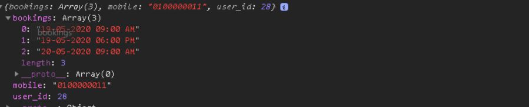

# Car Inspection Booking Module
## Form and Telephone Validation
```javascript
// Telephone validation with Regex
// and Toasting Error Msg 
phoneReg = /^01\d{8}/g

  errorMsg = []
    if (name == "" || name == null) {
        errorMsg.push('Name Field cannot be empty')
    }
    
    if (mobile == "" || mobile == null) {
        errorMsg.push('Telephone Number Field cannot be empty')
    }else if (phoneReg.test(mobile) == false) {
        errorMsg.push('Mobile phone number format wrong, Ex: 0127898903')
    }
    
    if (errorMsg.length>0){
        errorMsg.forEach( msg => M.toast({html: msg, classes:'toast-error'}))

    }else if (errorMsg.length==0){
        // console.log(bookingForm)
        bookingForm.style.display='block'
        inputs[0].disabled = true;
        inputs[1].disabled = true;

        submitUser();
    } 
```
## Retrive User Bookings after Validate from server
</a>