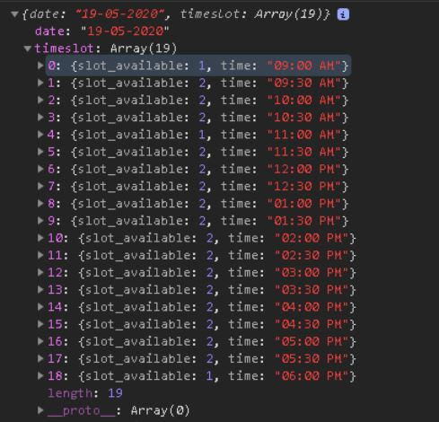

# Car Inspection Booking Module
## Front End Form handling
### Form and Telephone Validation
```javascript
// Telephone validation with Regex
// and Toasting Error Msg 
phoneReg = /^01\d{8}/g

  errorMsg = []
    if (name == "" || name == null) {
        errorMsg.push('Name Field cannot be empty')
    }
    
    if (mobile == "" || mobile == null) {
        errorMsg.push('Telephone Number Field cannot be empty')
    }else if (phoneReg.test(mobile) == false) {
        errorMsg.push('Mobile phone number format wrong, Ex: 0127898903')
    }
    
    if (errorMsg.length>0){
        errorMsg.forEach( msg => M.toast({html: msg, classes:'toast-error'}))

    }else if (errorMsg.length==0){
        // console.log(bookingForm)
        bookingForm.style.display='block'
        inputs[0].disabled = true;
        inputs[1].disabled = true;

        submitUser();
    } 
```
<<<<<<< HEAD
### Retrive User Bookings after Validate from server


### Retrieve available slot based on User Date Selection


### Populate the Selection option based on bookings and available slot
```javascript
userhoursBooked = getHoursBooking(dateSelected)

slotAvailable.forEach(function(elem){
// Populate the Option Selection with Condition
option = document.createElement("option")
option.value = elem.time
                    
hour = moment(elem.time , 'hh:mm a').hours()
    // if user already book this hour.. 
    if(userhoursBooked.includes(hour)){
        option.innerHTML=elem.time + " (You Have booked this slot)"
        option.disabled = true
    // if have free slots ... 
    }else if (elem.slot_available > 0) {
        option.innerHTML = elem.time + '  '+ `(${elem.slot_available} slot left )` 
    // if Slot already full ... 
    }else if(elem.slot_available==0){
            option.innerHTML = elem.time + ' (Slot Full)';
            option.disabled = true
            }
                  
 timeSlot.appendChild(option);
});
    $('select').formSelect();
```
## Backend Server API
### Validating User
```python
   user_exist = User.get_or_none(User.mobile_num == mobile)
    #
if user_exist == None:
    new_user = User(name=name , mobile_num = mobile)
    new_user.save()
    data['user_id'] = new_user.id
    data['mobile']  = new_user.mobile_num
    data['bookings'] = []
else:
    # if new user, add to database
    data['user_id'] = user_exist.id
    data['mobile'] = user_exist.mobile_num
    data['bookings'] = [booking.booking_time.strftime('%d-%m-%Y %I:%M %p')  for booking in user_exist.bookings.order_by(Booking.booking_time)]

    res = make_response(jsonify(data),200)
    return res
```
### Check time slot from date selected, and return time frame and slot available
```python
def timeslot():
    data = {}
    dateinput = request.form['dateSend']
    start_time = dt.datetime.combine(dt.datetime.strptime(dateinput,'%d-%m-%Y'), time(9,0))
    bookedslot = Booking.select().where((Booking.booking_time >= start_time) &
                                        (Booking.booking_time <= start_time+timedelta(hours=10))
                                        ).order_by(Booking.booking_time)
    booking_list = [value.booking_time for value in bookedslot]
    data['timeslot'] = [{'time': (start_time+timedelta(minutes=i*30)).strftime('%I:%M %p') , 
                         'slot_available':check_slot_available(start_time+timedelta(minutes=i*30),booking_list)} for i in range (0,19) ] 
    data['date'] = dateinput
    # Simulate Loading Graphic.. put some delay.
    ti.sleep(0.1);
    return make_response(jsonify(data),200)
```
### Check time slot from date selected, and return time frame and slot available
```python
user = User.get_or_none(User.mobile_num == mobile)
bookSlotValidate = Booking.select().where(Booking.booking_time == datetimeformat)
    # This is to double confirm whether slot fully booked , in case the booking was done by different user session.
    if len(bookSlotValidate) > 0:
        slot_booked = check_slot_available(datetimeformat,[slot.booking_time for slot in bookSlotValidate])
        if slot_booked == 0:
            res = make_response(jsonify('Slot was Booked by Other user'),422)
            return res
        
# Update to Database
booking = Booking(booking_time = datetimeformat, user = user , slot =1 )
booking.save()
```
=======
## Retrive User Bookings after Validate from server
</a>
>>>>>>> d78c1bb9d571c938a83bee6890507224dab2c05a
